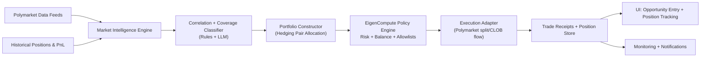

# Eigen Poly

Polymarket alpha detection and execution platform.

This project is designed to detect and act on pricing inefficiencies across correlated prediction markets by combining:
- predefined quantitative rules,
- LLM-based relationship classification,
- risk- and balance-aware execution policies,
- verifiable intent-to-action execution via EigenCompute.

## Product Idea

### Polymarket Alpha Detection Platform
Find covering portfolios across correlated prediction markets using predefined rules and LLM decisions. The system detects relationships between markets, classifies them to identify hedging pairs, and tracks their prices. The platform offers a smooth UI for entering detected pairs when profit opportunities exist and tracking your positions.

### Core goal
Turn natural-language or strategy intents into deterministic, auditable trading actions with strict risk controls. Every trade decision is validated against:
- available balances,
- account-level risk limits,
- market quality filters,
- execution-policy allowlists.

## Strategy Thesis

### 1) Detect market relationships
The engine continuously ingests market metadata and pricing from Polymarket and computes candidate pairs/groups that could hedge each other.

### 2) Classify relationship type
Each candidate pair is labeled using:
- rule-based logic (market structure, resolution constraints, price consistency),
- LLM reasoning (semantic relationship, implication strength, inverse linkage confidence).

### 3) Build covering portfolios
For correlated or anti-correlated pairs, the system computes hedge allocations that optimize for:
- positive expected edge,
- bounded downside,
- minimum target coverage confidence.

### 4) Execute only when edge survives constraints
No trade is sent unless all checks pass:
- sufficient liquidity,
- slippage and fill viability,
- position and daily risk caps,
- wallet balance and gas sufficiency,
- policy compliance.

## EigenCompute-Based Execution Model

EigenCompute is the control plane for decision verification and execution safety.

- Intent compilation:
  - strategy signal -> explicit execution plan
- Deterministic checks:
  - risk rules, limits, and account permissions
- Verified action steps:
  - each step emits traceable receipts
- Post-trade reconciliation:
  - PnL update, exposure update, and policy feedback loop

### Risk and balance aware trading
Trade sizing and placement are dynamic and depend on live state:
- available USDC and collateral
- exposure per market/topic
- active drawdown and volatility regime
- confidence score of correlation/coverage model

## Technical Architecture



### Components

1. `apps/backend` (Polyclaw backend)
- Trading engine and market operations
- Position tracking and execution scripts
- Hedge scanning and LLM-assisted relationship analysis

2. `apps/web` (Next.js frontend)
- Opportunity dashboard
- Pair/portfolio entry UI
- Position and PnL tracking views

3. `packages/ui`
- Shared UI components and styling primitives

4. EigenCompute policy layer (integration target)
- Verifiable plan compilation
- strict per-action policy enforcement
- risk/balance gating before execution

## Repository Structure

```text
/Users/nisargthakkar/Projects/eigen_poly
├── apps/
│   ├── backend/     # chainstacklabs/polyclaw codebase (Python)
│   └── web/         # Next.js app
├── packages/
│   └── ui/          # shared React UI package
├── package.json     # Turbo workspace root
└── turbo.json
```

## Local Development

## Prerequisites
- Bun (workspace tooling)
- Python 3.11+
- `uv` (recommended for Python dependency management)
- Polymarket-compatible wallet + RPC credentials for live trading

## Run frontend

```bash
cd /Users/nisargthakkar/Projects/eigen_poly
bun install
bun run dev --filter=web
```

## Run backend (Polyclaw)

```bash
cd /Users/nisargthakkar/Projects/eigen_poly/apps/backend
uv sync
uv run python scripts/polyclaw.py --help
```

Configure backend environment using the variables required by Polyclaw (for example RPC endpoint, wallet key, and LLM provider key) in the backend runtime environment.

## Target Operating Flow

1. Pull live market universe and price states.
2. Generate correlated candidate pairs.
3. Score each pair with rules + LLM confidence.
4. Construct covering portfolios and expected edge.
5. Pass candidate execution plan through EigenCompute policy engine.
6. Execute approved trades on Polymarket.
7. Persist receipts, positions, PnL, and risk state.
8. Surface opportunities and portfolio health in UI.

## Security Principles

- No hardcoded secrets.
- Principle of least privilege for all keys.
- Deterministic risk rules before every execution.
- Traceable receipts for every action.
- Clear separation of detection, decision, and execution layers.

## Current Status

- Backend switched to `apps/backend` (Polyclaw base).
- Web app scaffold is active in `apps/web`.
- Root docs now aligned to the alpha-detection + EigenCompute architecture.

## Disclaimer

This project is for research and engineering purposes. Prediction-market trading carries real financial risk. Use conservative limits, isolate keys, and run only with capital you can afford to lose.
